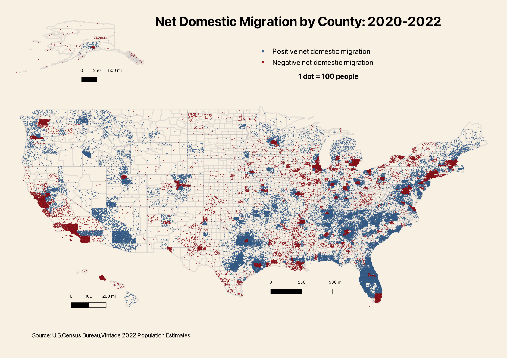

# U.S. Net Domestic Migration by County: 2020-2022
View the notebook: [net-domestic-migration-by-county.ipynb](//github.com/christianmendoza/net-domestic-migration-by-county/blob/main/net-domestic-migration-by-county.ipynb)

Recreating the U.S. Census Bureau's [dot-density map](https://www.census.gov/library/stories/2023/03/domestic-migration-trends-shifted.html#titlecore-ebc32996d9) which illustrates the domestic migration across counties from 2020 to 2022.

Using [pandas](https://pandas.pydata.org/) to clean and wrangle the dataset, [geopandas](https://geopandas.org/) to merge with the geospatial data,and [QGIS](https://www.qgis.org/en/site/) to create the dot-density map.

- Domestic migration dataset from the [U.S. Census Bureau](https://www.census.gov/data/datasets/time-series/demo/popest/2020s-counties-total.html#v2022)
- Cartographic boundary shapefile for all the counties: [U.S. Census Bureau](https://www.census.gov/geographies/mapping-files/time-series/geo/cartographic-boundary.html#ti1804832544), [shapefile](https://www2.census.gov/geo/tiger/GENZ2021/shp/cb_2021_us_county_5m.zip)
- `.geojson` file for Connecticut's new planning regions: [CT Geodata Portal](https://geodata.ct.gov/), [data](https://geodata.ct.gov/maps/743ea4808b85469d8d9f7c5e6b661ee8)

View the pdf version: [net-domestic-migration-dots-100.pdf](pdfs/net-domestic-migration-dots-100.pdf)
